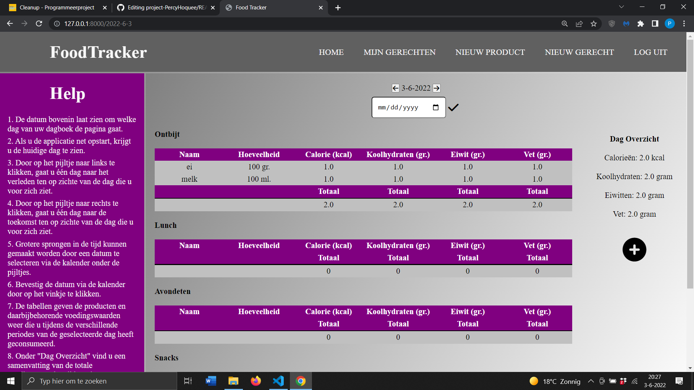
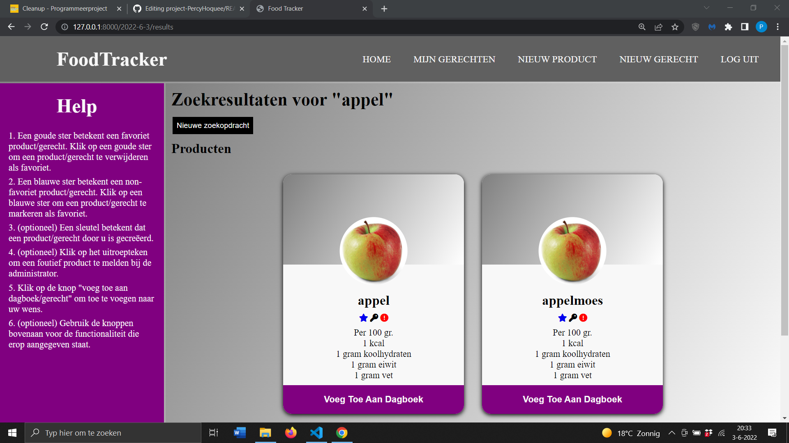

# FoodTracker
De FoodTracker applicatie biedt gebruikers alle functionaliteit die nodig is voor het bijhouden van hun voeding.
Gebruikers kunnen naar wens producten aanmaken en toevoegen aan hun voedingsdagboek. 
Producten kunnen ook samengevoegd worden tot gerecht voor verdere personalisering.
Gebruikers krijgen vervolgens een overzicht te zien van hun dagelijkse voeding met daarin de waarden van hun calorie-, koolhydraat-, eiwit- en vetinname.

## Belangrijk!!
Beweeg naar de directory project-PercyHoquee/food_tracker/. Daar gekomen geef het commando "pip install -r requirements.txt" of "pip3 install -r requirements.txt", afhankelijk van welke versie u gebruikt. Requirements.txt bevat de installatie benodigd om de applicatie zowel on- als offline te kunnen gebruiken. 

## Auteurs
- [@Percy Hoquee](https://github.com/PercyHoquee)

## Bronvermelding
Foto's:
- project-PercyHoquee/food_tracker/static/docs/appel.jpg, afkomstig van https://www.foodandfriends.nl/app/uploads/2020/12/appel-artikel.jpg
- project-PercyHoquee/food_tracker/static/docs/melk.webp, afkomstig van https://media.levenvanhetland.nl/1514-medium_default/melkfles-1-liter-inclusief-deksel.jpg
- project-PercyHoquee/food_tracker/static/docs/schijf_van_vijf.jfif, afkomstig van https://www.darmgezondheid.nl/wp-content/uploads/2016/06/schijf-van-vijf-300x300.jpg

Code:
- project-PercyHoquee/food_tracker/static/food_tracker/form.scss lijn 3 tot en met 38, afkomstig van https://youtu.be/v1PeTDrw6OY
- project-PercyHoquee/food_tracker/static/food_tracker/form.scss lijn 41 tot en met 76, afkomstig van https://youtu.be/2ACrHs5o9LM
- project-PercyHoquee/food_tracker/static/food_tracker/form.scss lijn 96 tot en met 185, afkomstig van https://youtu.be/eeHqZeJ9Vqc
- project-PercyHoquee/food_tracker/static/food_tracker/index.scss grid-layout, afkomstig van https://youtu.be/68O6eOGAGqA
- project-PercyHoquee/food_tracker/static/food_tracker/layout.scss grid-layout, afkomstig van https://youtu.be/68O6eOGAGqA
- project-PercyHoquee/food_tracker/static/food_tracker/layout.scss navbar & sidebar, afkomstig van https://youtu.be/oLgtucwjVII
- project-PercyHoquee/food_tracker/static/food_tracker/results.scss lijn 3 tot en met 51, afkomstig van https://youtu.be/Aje9cXDzklk & https://youtu.be/k3YHfp8Bp_E
- project-PercyHoquee/food_tracker/templates/food_tracker/ icons gebruikt in de html bestanden, afkomstig van https://fontawesome.com/start
- project-PercyHoquee/food_tracker/views.py lijn 79 tot en met 139, afkomstig van Programmeerproject opdracht Commerce: https://project.mprog.nl/django/projects/commerce
