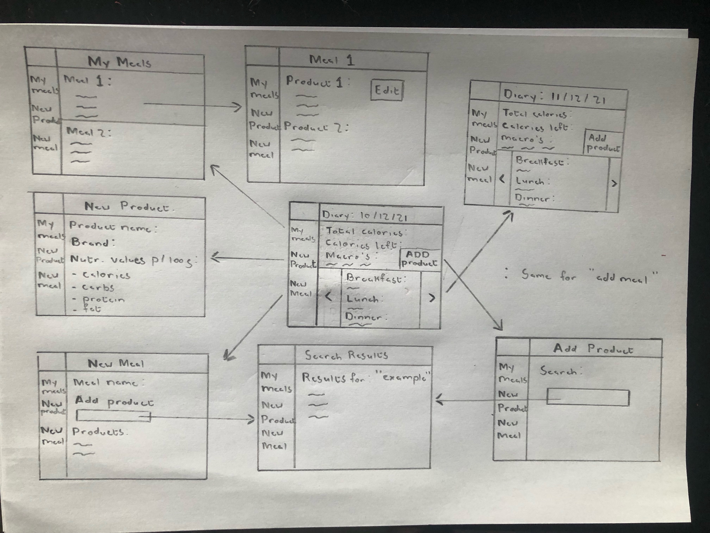

# Project Voorstel Food Tracker
Deze applicatie streeft ernaar om mensen te ondersteunen richting
hun gewichtsdoelen. 
De applicatie doet dit door een structuur te bieden waarin zij alle 
feiten rondom hun dagelijkse voeding snel en eenvoudig vast kunnen
leggen.

## Authors

- [@Percy Hoquee](https://github.com/PercyHoquee)

## Oorsprong
Sinds de jaren 80 is het percentage volwassen met overgewicht 
elk decenium gestegen. 
Op dit moment, anno 2021, heeft de helft van de volwassen
Nederlanders overgewicht. 
https://www.cbs.nl/nl-nl/nieuws/2018/27/100-duizend-volwassenen-hebben-morbide-obesitas.

De doelgroep van dit project bestaat uit mensen die de noodzaak
voelen om hun voeding bij te houden. 
Dit betekent in de eerste plaats dat zij hun calorieën willen 
tellen. 
Daarnaast willen ze ook hun macro's (koolhydraten, eiwitten,
vetten) bijhouden.
 
## Sketch
Deze applicatie zal de doelgroep structuur, regelmaat en een
snelle gebruikservaring bieden. 
Al deze eigenschappen zullen belangrijk zijn om de gebruikers 
te ondersteunen met hun gewichtsdoelen
, wat die dan ook mogen zijn. 

## Voorwaarden
- Data: 
    de database wordt gevuld met de voedingswaarden van individuele
    producten. In Nederland is het verplicht voor producenten van
    levensmiddelen om op de verpakking een etiket te plakken met
    daarop de voedingswaarden van hun product.
    De gebruiker heeft de mogelijkheid om deze waarden met de 
    hand in te vullen. 
    Daar is verder geen transformatie van data 
    voor nodig. 
    De mogelijkheid om een online database te scrapen 
    wordt onderzocht. [Hier](https://www.calorietabel.nl/index.php?idd=a)
    een voorbeeld van een website die 
    gescrapet zou kunnen worden. 
- Externe Componenten:
    De applicatie zal gebouwd worden via Django. Een 
    Bootstrap sidebar zal gebruikt worden om een layout te maken
    die voor alle pagina's geladen zal worden. 
    Deze sidebar zal links bevatten voor betere site navigatie.
- Vergelijkbare Webapps: 
    de trend die vergelijkbare apps volgen is een gratis versie 
    aanbieden waar de gebruiker toegang heeft tot de producten 
    database. 
    Met een premium versie bieden ze dan extra's aan, waaronder 
    het toevoegen van maaltijden. Deze applicatie biedt de optie om
    maaltijden op te slaan gratis aan. Gebruikers kunnen hierdoor 
    maaltijden die ze regelmatig eten sneller opslaan, in plaats
    van elke keer de producten een voor een op te zoeken.
    - MyFitnesspal: 
        de index pagina laat de gebruiker zien wat zijn/haar 
        calorieën inname is die dag en hoeveel calorieën er nog 
        geconsumeerd kunnen worden op basis van gestelde quotas.
        De gebruiker kan op een link klikken "add food" en wordt 
        naar de food diary genomen. 
        In de food diary worden de verschillende eetmomenten van 
        elkaar gescheden door middel van html tabellen. 
    - Virtuagym Food (telefoon): 
        in tegenstelling tot MyFitnesspal legt Food meer de nadruk
        op relatieve aantallen; de geconsumeerde hoeveelheden worden
        ook afgebeeld als percentage van de dagelijkse quotas.
- Grootste Uitdaging:
    Het implementeren van een scraper die uit een calorieën 
    overzicht website een database kan creëren. 
    De benodigde skils zijn geoefend in eerdere vakken, alleen de
    vraag is, gaat een scraper functie niet heel veel laad tijd 
    kosten en op welk moment zou een dergelijke functie geroepen
    moeten worden. 
    Waarschijnlijk zou de functie geroepen moeten worden voor elke 
    db.sqlite file; 
    per computer 1x of kan sqlite file mee in de github push?
    Update: er hoeft maar een keer gescrapet te worden zolang de csv
    file die eruit komt, wordt opgeslagen in een github folder "data"
